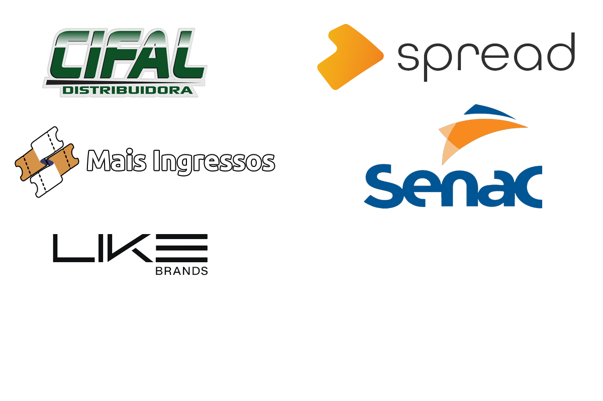

  

  <h1>Davi Paulino | Taiyo</h1>
  

    Mobile Developer focused on Flutter, web solutions, automation, and user-centered digital experiences.
  

  

    I build products with clean interfaces, practical business value, and a strong attention to performance, usability, and continuous improvement.
  

  
  
  

---

## Professional Summary

I am a developer passionate about technology since childhood, with experience building applications, experimenting with new tools, and turning ideas into useful products.

My main focus is Flutter development, but I also work across web technologies, automation, testing, and back-end related tools when the project requires a broader technical view.

I value clear communication, product thinking, and solutions that are not only functional, but also pleasant to use and easy to evolve.

---

## What I Focus On

- Building mobile and web experiences with strong usability.
- Creating maintainable solutions with practical business impact.
- Learning fast and adapting to different products, teams, and challenges.
- Combining technical execution with creativity, curiosity, and consistency.

---

## Core Stack

  
  
  
  
  
  
  
  
  
  

  Flutter | Dart | JavaScript | TypeScript | Python | C# | Java | MySQL | Selenium

---

## GitHub Overview

  
  

---

## About Me

  

I am Davi, also known as Taiyo. Outside of coding, I enjoy games, anime, movies, series, music, discovering new places, and trying different foods.

That personal curiosity is part of how I work as a developer too. I like exploring, testing ideas, improving details, and finding better ways to build things that people genuinely enjoy using.

---

## Experience

  

I have contributed to projects and companies that helped shape my technical maturity and professional perspective. These experiences strengthened my adaptability, collaboration skills, and ability to deliver in different business contexts.

  

---

## Contact

If you want to talk about technology, products, freelance opportunities, collaboration, or just connect professionally, feel free to reach out.

  
  
  

  <strong>Email:</strong> DaviTaiyo@Outlook.com 
  <strong>Discord:</strong> Taiyo0458

